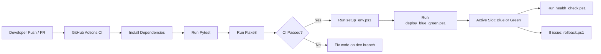
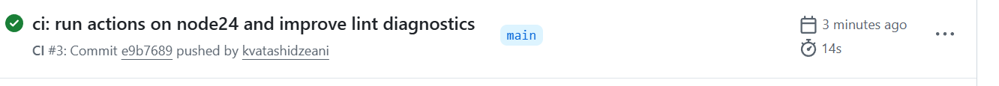
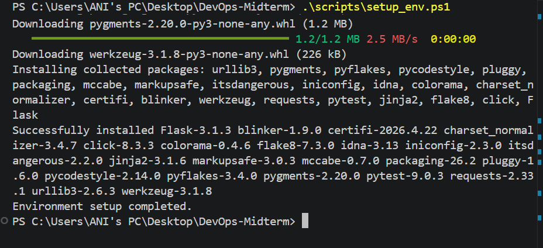
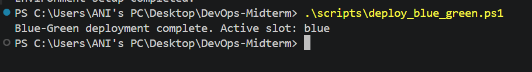
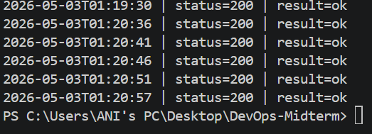

# Midterm - DevOps Project

This repository contains a small web application and a complete DevOps workflow implementation that satisfies the midterm requirements.

> Important: avoid committing after your deadline. Finalize and push everything on time.

## Repository Link

- GitHub: [https://github.com/kvatashidzeani/DevOps-Midterm](https://github.com/kvatashidzeani/DevOps-Midterm)

## Tech Stack

- **Language:** Python 3.11
- **Web Framework:** Flask
- **Testing:** Pytest
- **Linting:** Flake8
- **CI:** GitHub Actions
- **Automation / IaC style scripting:** PowerShell scripts
- **Deployment model:** Local Blue-Green simulation (blue/green slots)
- **Monitoring:** PowerShell health check logger

## Project Requirements Mapping

### 1) Web Application

- Dynamic route: `GET /hello/<name>`
- Input form + endpoint:
  - Form UI: `GET /`
  - Submit endpoint: `POST /submit`
- Health endpoint: `GET /health`
- Unit tests: `tests/test_app.py`

### 2) Version Control (Git)

Use at least these branches:

- `main` (stable branch)
- `dev` (active development branch)

Recommended workflow:

1. Develop on `dev`.
2. Create pull requests into `main`.
3. Use clear commit messages, for example:
   - `feat: add Flask app with dynamic route and form`
   - `ci: add GitHub Actions workflow for pytest and flake8`
   - `ops: add blue-green deployment and rollback scripts`

## Step-by-Step Setup and Run Guide

### Prerequisites

- Python 3.11+ installed and available in `PATH`
- PowerShell 5+ or PowerShell 7+
- Git installed

### Step 1 - Clone and open

```powershell
git clone https://github.com/kvatashidzeani/DevOps-Midterm.git
cd DevOps-Midterm
```

### Step 2 - Environment preparation (single-command automation)

Run:

```powershell
.\scripts\setup_env.ps1
```

What this command does:

- Creates virtual environment `.venv` (if missing)
- Installs dependencies from `requirements.txt`
- Creates deployment directories:
  - `deployments/blue`
  - `deployments/green`
- Creates logging directory `logs/`
- Creates deployment marker file `deployments/active_slot.txt`

### Step 3 - Run tests and lint locally

```powershell
.\.venv\Scripts\python.exe -m pytest -q
.\.venv\Scripts\python.exe -m flake8 app.py tests
```

### Step 4 - Blue-Green deployment simulation

Deploy to the inactive slot and switch traffic marker:

```powershell
.\scripts\deploy_blue_green.ps1
```

Run deployed app from active slot:

```powershell
.\scripts\run_local_prod.ps1 -Port 5000
```

Open:

- `http://127.0.0.1:5000/`
- `http://127.0.0.1:5000/hello/Ani`
- `http://127.0.0.1:5000/health`

### Step 5 - Rollback mechanism

Rollback to previous slot:

```powershell
.\scripts\rollback.ps1
```

Then run production again:

```powershell
.\scripts\run_local_prod.ps1 -Port 5000
```

### Step 6 - Monitoring and health-check logging

Run periodic health checks:

```powershell
.\scripts\health_check.ps1 -Url "http://127.0.0.1:5000/health" -IntervalSeconds 10 -Iterations 12
```

Logs are written to:

- `logs/health_check.log`

## Continuous Integration (GitHub Actions)

CI workflow file:

- `.github/workflows/ci.yml`

It triggers automatically on every:

- Push to `main` or `dev`
- Pull Request targeting `main` or `dev`

Pipeline steps:

1. Checkout repository
2. Setup Python 3.11
3. Install dependencies
4. Run unit tests (`pytest`)
5. Run linting (`flake8`)

## Workflow Diagram (CI/CD)



## Embedded Screenshots (Evidence)

Add your screenshots in the `docs/images/` directory and keep the links below updated.

### 1) Successful CI pipeline run



### 2) Successful IaC automation execution (`setup_env.ps1`)



### 3) Deployment process and running app




### 4) Monitoring logs (`health_check.log`)



## Suggested Submission Checklist

- [ ] `main` and `dev` branches are present and updated.
- [ ] CI passes for latest commit.
- [ ] Setup script runs from one command.
- [ ] Blue-Green deploy script and rollback script work.
- [ ] Health check script produces logs.
- [ ] README includes all required screenshots and final repository link.
